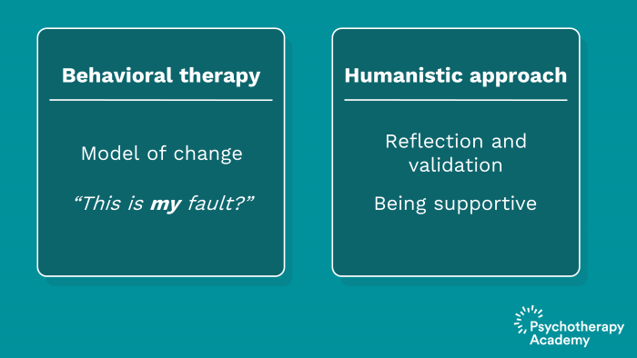
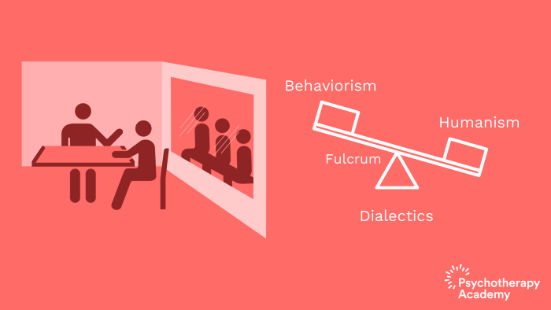

## Introduction

In this document I will try to laydown my thoughts about this project. Taking part of a group about DBT has been a life changing experience for me, DBT is a super important tool but I also noticed from my experience the following issues.
* Eventhough DBT has the potential for allowing plenty of interactive exercises, most of the tooling out there relies on classical learning techniques like pen & paper worksheets or classical articles, books and blogposts.
* Most of the publicly available materials are in English and at least from my experience with Arabic language DBT each clinic or group of therapists need to kind of re write the materials from scratch.
* It is of course important to try and train the brain on remembering all different set of skills and what steps are there in every skill, but I think that some tool using interactive flow can assist massively specially at times of emotional overload.

## What is DBT?

Dialectical behavioral therapy is a type of cognitive behavioral therapy that was originally intended treat borderline personality disorder (BPD) with a focus on women specifically but since its birth in the 1970s on the hands of Dr. Marsha Linehan it has developed and adapted and is now imperically validated to aid with substance use disorders, self distructive behaviors, ptsd, symptoms of depression & anxiety, eating disorders and plenty of other stuff. But it's definitely not just for "severe populations".

What Dialectical behavioral therapy focuses on is to blend in ideas from both behaviorism and humanism.






DBT focuses a lot on both acceptance and change, so in a nutshell, it helps you tolerate and accept your life circumstances, your emotions and yourself but also helps you develop skills that aids in making positive changes to your behaviors, interactions and maybe even circumstances.

## What are the different modules of DBT?

* **Core Mindfullness:** The core module of DBT which includes a set of skills that focuses on living in the present moment not in the past or the future and paying attention to what's happening inside you (Your thoughts, emotions,...etc.) and what's happening in your surroundings by using all your senses.
* **Emotional Regulation:** This module focuses on helping patients regulate their emotions through being able to name them, understand their purpose, decrease the intensity of "unwanted" emotions, decrease their impact on their lives and finally increase the frequency of "wanted" emotions.
* **Distress tolerance:** This module introduces different skills that helps patients get to a more manageable emotional place for crisis survival.
* **Interpersonal Effectiveness:** This module focuses on aiding patients with skills to grow strong roots and build or maintain healthier relationships.

## User Roles of the system

In my opinion there are the initial main user roles of this system:
* Guests
* Therapists
* Patients
* Clinic Admin
* System Admin

## Contribution

### Setup

After you clone the repo just run:
```
% make setup
```

How to run tests:

```
% make test
```
 or
 ```
 % make dev
 % bundle exec rspec
 ```
 
How to run the development console:
```
% make console
```
 or
 ```
 % make dev
 % bundle exec hanami console
 ```


How to run the development server:

```
% make up
```

How to prepare (create and migrate) DB for `development` and `test` environments:

```
% make db-prepare
% make db-test-prepare
```
OR
```
% make dev

% bundle exec hanami db prepare

% HANAMI_ENV=test bundle exec hanami db prepare
```
